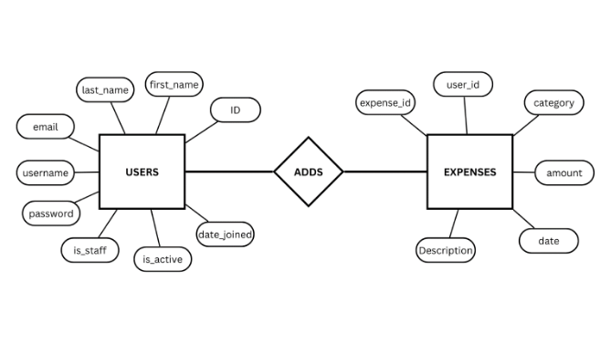
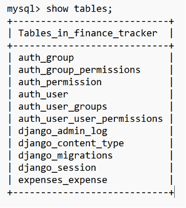
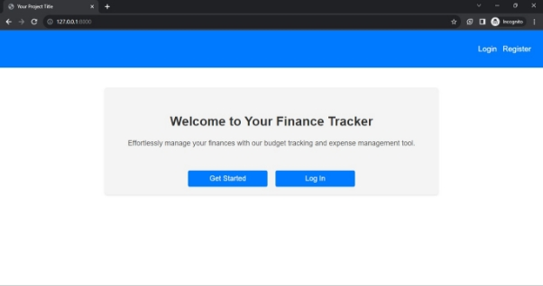
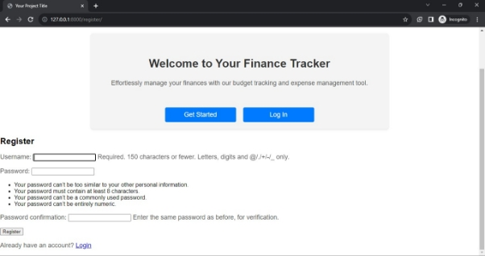
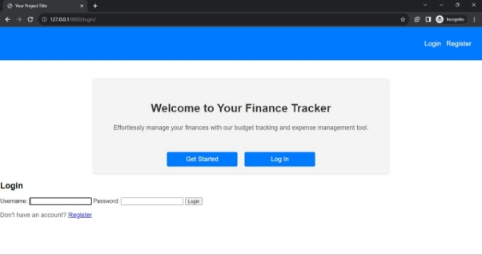
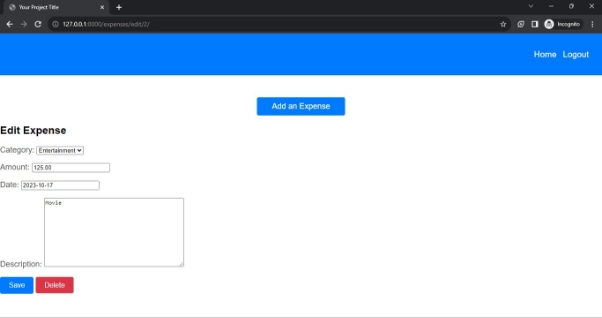
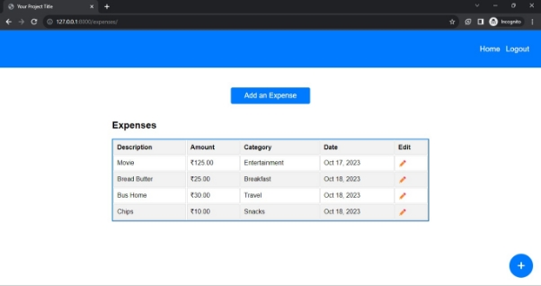
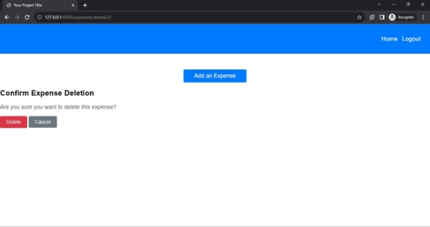
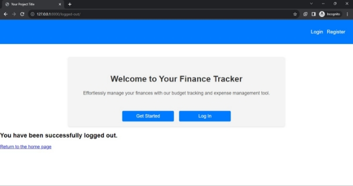

# finance-tracker

**ABSTRACT**

The Finance Tracking Software is a comprehensive tool developed to assist individuals in managing their financial activities effectively. This software is designed to facilitate users in creating profiles and tracking their financial transactions seamlessly. Built on the Django framework with MySQL as the backend database, this application provides a user-friendly interface using simple HTML and CSS. The primary objective of the software is to enable users to maintain a detailed record of their daily financial activities. By inputting the financial data, users can effortlessly track their expenses, monitor their spending patterns, and make informed financial decisions. The intuitive interface ensures that users can easily navigate through the application and manage their financial data efficiently. Key features of the software include the creation of user profiles, a streamlined input system for recording daily financial transactions, real-time display of the transactions, and personalized financial insights. The application leverages the robust capabilities of Django to ensure secure data storage and efficient data retrieval from the MySQL database. Moreover, the minimalistic yet visually appealing frontend design enhances the user experience and promotes a seamless interaction with the application.

||
| - |
|

**1.1 SCOPE**

The scope of the Finance Tracking Software project is expansive and holds significant promise for individuals seeking efficient and user-friendly financial management solutions. This project offers a platform for users to create and manage personal profiles, allowing them to record daily financial transactions. In this way the software furnishes immediate insights into spending patterns and financial health. Moreover, the secure and reliable data management system, powered by Django and MySQL, ensures that users' financial information is protected and accurate. The user-friendly frontend interface, designed with simplicity and visual appeal in mind, enhances accessibility and promotes an intuitive user experience. Beyond basic expense tracking, this project has the potential to offer valuable financial insights, helping users make informed decisions regarding budgeting, saving, and investments.

This software can also be used further for the comprehensive personal finance manager. It has potential to provide complete finance management.

**1.2 REQUIREMENT ANALYSIS**

This analysis helps in identifying the functional and non-functional requirements, ensuring that the software meets the needs of its users effectively.

Users must have the ability to record daily financial transactions.

The system should display the expense table (financial transactions) in real-time, allowing users to track their financial health continuously.

The software should store and retrieve user data efficiently, utilizing MySQL as the backend database.

The frontend should provide an intuitive and user-friendly interface for users to navigate and interact with the software.

 

**1.3 SOFTWARE AND HARDWARE DETAILS**

**HARDWARE:**

- Server

- PC/Computer

**SOFTWARE:**

- MySQL (database)

- HTML

- CSS

- Django/Python
|
||

**2 ER DIAGRAM**

**3 SCREENSHOTS**

**Home Page:**

**Register Page:**

**Login Page:**

**Add expenses:**

**Expense Table:**

**Deleting the earlier expenses:**

**Logout of the User:**

